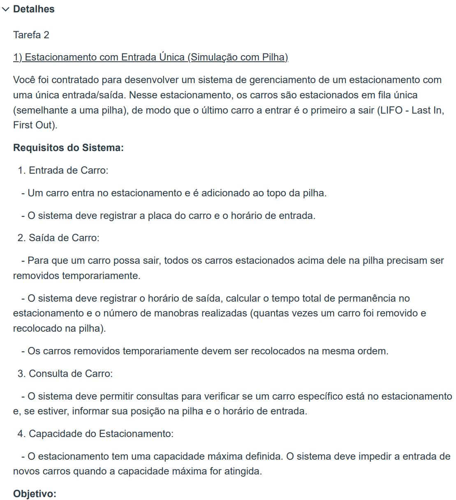
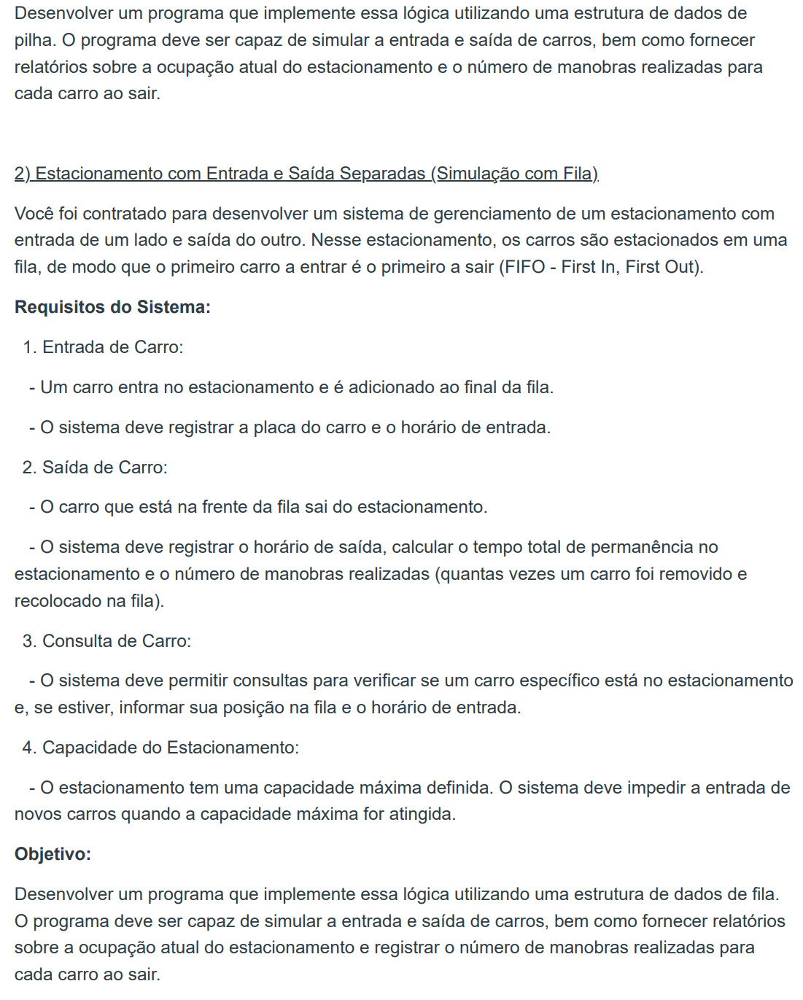

<h1 align="center">Trabalho de Estrutura de Dados T2 <picture><source srcset="https://fonts.gstatic.com/s/e/notoemoji/latest/2699_fe0f/512.webp" type="image/webp"></picture></h1>
<h2 align="center">Aplicação de pilhas <picture><source srcset="https://fonts.gstatic.com/s/e/notoemoji/latest/1f50b/512.webp" type="image/webp"></picture> e filas <picture><source srcset="https://fonts.gstatic.com/s/e/notoemoji/latest/1f3a2/512.webp" type="image/webp"></picture></h2>

**CÓDIGO FEITO EM JAVA 22**

# Detalhes do T2 <picture><source srcset="https://fonts.gstatic.com/s/e/notoemoji/latest/1f9d0/512.webp" type="image/webp"></picture>

# Colaboradores 🤝

<table>
  <tr>
    <td align="center">
      <a href="#">
         
        
          
<b><i>Alessandro Lima:</i></b> <a href="https://github.com/alexZ7000"><i>alexZ7000</i></a> RA: 23.01172-6

        
      </a>
    </td>
    <td align="center">
      <a href="#">
         
        
          
<b><i>Gabriel Merola:</i></b> <a href="https://github.com/gabrielmerola"><i>gabrielmerola</i></a> RA: 23.00825-3

        
      </a>
    </td>
    <td align="center">
      <a href="#">
         
        
          
<b><i>Luca Pinheiro:</i></b> <a href="https://github.com/LucaPinheiro"><i>Luca Pinheiro</i></a> RA: 23.00335-9

        
      </a>
    </td>
    <td align="center">
      <a href="#">
         
        
          
<b><i>Marcelo Zoletti:</i></b> <a href="https://github.com/ZettDev"><i>ZettDev</i></a> RA: 23.00171-2

        
      </a>
    </td>
  </tr>
</table>

